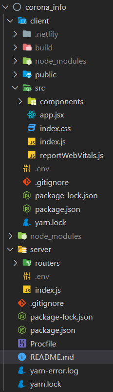
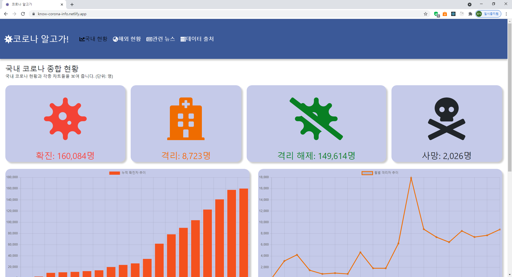
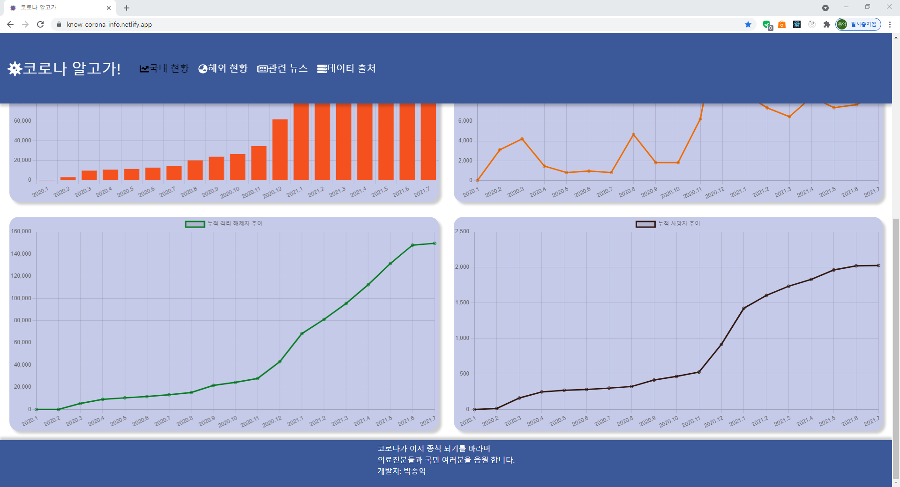
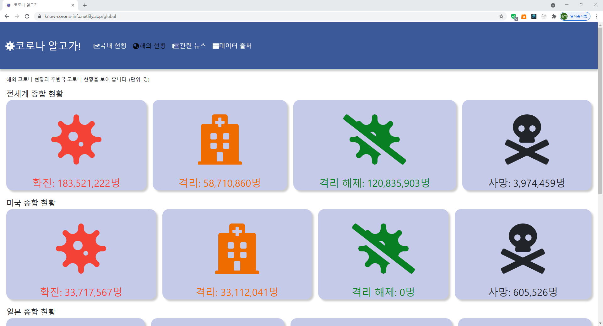
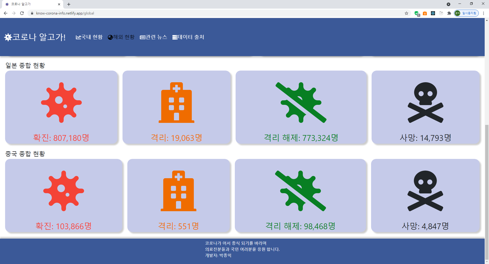
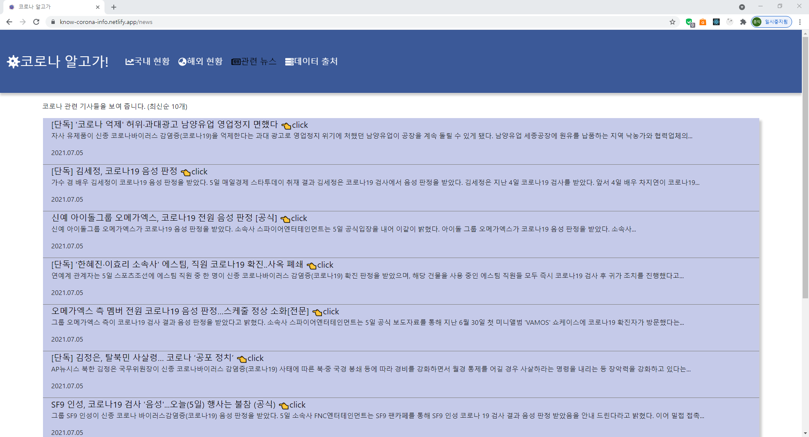
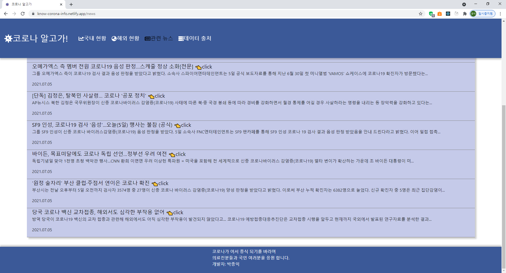

# 1. 개요

국내와 해외 코로나 통계와 국내 코로나 관련 뉴스를 보여주는 사이트 입니다.<br>
<br>

### 프로젝트 실행 방법

프로젝트 root 경로(/corona_info)에서 npm run dev 입력<br>
<br>

### 프로젝트 URL

https://know-corona-info.netlify.app/<br>
<br>

# 2. 사용기술

- PostCSS, React, Node.js(express)
- 라이브러리: axios, react-chartjs-2, react-router-dom, moment, request
- 배포: 프론트엔드: netlify, 백엔드: heroku
- Coronavirus COVID19 API(국내 및 해외 코로나 통계)
- 네이버 뉴스 API<br>
  <br>

# 3. 기능과 코드

파일 구조<br>
<br>
<br>

## (1) 국내 코로나 종합 현황 및 차트 제공

오픈 API를 통하여 국내 코로나 종합 현황과 각각의 차트를 제공 하고 있습니다.<br>
<br>
<br>
<br>
<br>

## client > src > components > kor-corona-data-kor-corona-data.jsx<br>

axios 라이브러리로 오픈API에서 응답 받은 데이터를 reduce로 가공 시켜 종합 현황 state에 넣어주고 있으며 각종 차트를 제공하기 위해서 reduce로 가공 시킨 데이터를 react-chartjs-2를 이용해서 차트를 만들어주고 있습니다.

```javascript
useEffect(() => {
  async function fetchData() {
    await axios
      .get('https://api.covid19api.com/total/dayone/country/kr')
      .then((res) => {
        makeData(res.data);
        setIsLoading(false);
      })
      .catch((err) => {
        setIsNormal(false);
        console.log('에러 발생! (o_0;)', err);
      });
  }

  fetchData();

  function makeData(data) {
    // API로 받은 데이터를 가공 ( 월별 누적 확진자 데이터로 )
    const arr = data.reduce((acc, cur) => {
      // 날짜 형식을 바꿈
      const curDate = new Date(cur.Date);
      const year = curDate.getFullYear();
      const month = curDate.getMonth();
      const date = curDate.getDate();

      const confirmed = cur.Confirmed;
      const active = cur.Active;
      const death = cur.Deaths;
      const recovered = cur.Recovered;

      // 누적 값에 현재 값의 년도와 월이 있는지 찾음
      const item = acc.find(
        (item) => item.year === year && item.month === month
      );

      // 없으면 아래 형태로 넣음 (없을 때만 넣어서 월별로 하루만 넣기 위해서)
      if (!item) {
        acc.push({ year, month, date, confirmed, active, death, recovered });
      }

      // 월별로 마지막 날로 갱신 (이전 날짜 데이터 덮어 씌움)
      if (item && item.date < date) {
        item.year = year;
        item.month = month;
        item.date = date;
        item.confirmed = confirmed;
        item.active = active;
        item.death = death;
        item.recovered = recovered;
      }

      return acc;
    }, []);
    // 가장 최근 종합 정보를 얻기 위한 마지막 인덱스
    const newest = arr[arr.length - 1];
    // 숫자에 3자리수마다 , 구분
    const confirmed = Number(newest.confirmed).toLocaleString();
    const active = Number(newest.active).toLocaleString();
    const recovered = Number(newest.recovered).toLocaleString();
    const death = Number(newest.death).toLocaleString();
    setOverallConfirm(confirmed);
    setOverallActive(active);
    setOverallRecover(recovered);
    setOverallDeath(death);

    const labels = arr.map((item) => `${item.year}.${item.month + 1}`);
    const confirmedData = arr.map((item) => item.confirmed);
    const activeData = arr.map((item) => item.active);
    const recoveredData = arr.map((item) => item.recovered);
    const deathData = arr.map((item) => item.death);

    //국내 누적 확진자 추이
    setConfirmedData({
      labels,
      datasets: [
        {
          label: '누적 확진자 추이',
          backgroundColor: '#f4511e',
          fill: true,
          data: confirmedData,
        },
      ],
    });

    // 월별 격리자 추이
    setMonthActive({
      labels,
      datasets: [
        {
          label: '월별 격리자 추이',
          borderColor: '#ef6c00',
          fill: false,
          data: activeData,
        },
      ],
    });

    // 월별 격리 해제자 추이
    setMonthRecovered({
      labels,
      datasets: [
        {
          label: '누적 격리 해제자 추이',
          borderColor: '#087f23',
          fill: false,
          data: recoveredData,
        },
      ],
    });

    // 월별 사망자 추이
    setMonthDeath({
      labels,
      datasets: [
        {
          label: '누적 사망자 추이',
          borderColor: '#321911',
          fill: false,
          data: deathData,
        },
      ],
    });
  }
}, []);
```

<br><br>

## (2) 해외 코로나 현황 제공

오픈 API를 통하여 해외 코로나 종합 현황을 제공하고 있습니다.<br>
<br>
<br>
<br>
<br>

## client > src > components > global-corona-data > global-corona-data.jsx<br>

axios 라이브러리로 응답 받은 오픈 API 데이터를 reduce로 가공 시켜 각각 state에 넣어서 화면에 렌더링 시켜주고 있습니다.

```javascript
useEffect(() => {
  // 해외 api
  const fetchGlobal = () => {
    return axios.get('https://api.covid19api.com/summary');
  };

  // 미국 api
  const fetchUs = () => {
    return axios.get('https://api.covid19api.com/total/dayone/country/us');
  };

  // 일본 api
  const fetchJp = () => {
    return axios.get('https://api.covid19api.com/total/dayone/country/jp');
  };

  // 중국 api
  const fetchCn = () => {
    return axios.get('https://api.covid19api.com/total/dayone/country/cn');
  };

  // 다중 api 호출
  axios
    .all([fetchGlobal(), fetchUs(), fetchJp(), fetchCn()])
    .then(
      axios.spread((global, us, jp, cn) => {
        makeData(global.data.Global, us.data, jp.data, cn.data);
        setIsLoading(false);
      })
    )
    .catch((err) => {
      setIsNormal(false);
      console.log('에러 발생! (o_0;)', err);
    });

  // 데이터 가공
  function makeData(global, us, jp, cn) {
    // 세계 종합 현황
    // 숫자 3자리수 마다 ,로 구분
    const globalConfirmed = Number(global.TotalConfirmed).toLocaleString();
    const globalActive1 =
      global.TotalConfirmed - (global.TotalRecovered + global.TotalDeaths);
    const globalActive2 = Number(globalActive1).toLocaleString();
    const globalRecovered = Number(global.TotalRecovered).toLocaleString();
    const globalDeath = Number(global.TotalDeaths).toLocaleString();
    setGlobalConfirmedData(globalConfirmed);
    setGlobalActiveData(globalActive2);
    setGlobalRecoveredData(globalRecovered);
    setGlobalDeathData(globalDeath);

    // 미국 종합 현황
    const usa = us[us.length - 1];
    // 숫자 3자리수 마다 ,로 구분
    const usConfirmed = Number(usa.Confirmed).toLocaleString();
    const usActive = Number(usa.Active).toLocaleString();
    const usRecovered = Number(usa.Recovered).toLocaleString();
    const usDeath = Number(usa.Deaths).toLocaleString();
    setUsConfirmedData(usConfirmed);
    setUsActiveData(usActive);
    setUsRecoveredData(usRecovered);
    setUsDeathData(usDeath);

    // 일본 종합 현황
    const japan = jp[jp.length - 1];
    // 숫자 3자리수 마다 ,로 구분
    const jpConfirmed = Number(japan.Confirmed).toLocaleString();
    const jpActive = Number(japan.Active).toLocaleString();
    const jpRecovered = Number(japan.Recovered).toLocaleString();
    const jpDeath = Number(japan.Deaths).toLocaleString();
    setJpConfirmedData(jpConfirmed);
    setJpActiveData(jpActive);
    setJpRecoveredData(jpRecovered);
    setJpDeathData(jpDeath);

    // 중국 종합 현황
    const china = cn[cn.length - 1];
    // 숫자 3자리수 마다 ,로 구분
    const cnConfirmed = Number(china.Confirmed).toLocaleString();
    const cnActive = Number(china.Active).toLocaleString();
    const cnRecovered = Number(china.Recovered).toLocaleString();
    const cnDeath = Number(china.Deaths).toLocaleString();
    setCnConfirmedData(cnConfirmed);
    setCnActiveData(cnActive);
    setCnRecoveredData(cnRecovered);
    setCnDeathData(cnDeath);
  }
}, []);
```

<br><br>

## (3) 국내 코로나 뉴스 정보 제공

네이버 뉴스 API를 통하여 코로나 관련 뉴스를 제공하고 있습니다.<br>
<br>
<br>
<br>
<br>

## server > routers > news-router.js

CORS를 해결 하기 위해 서버에서 네이버 뉴스 API를 호출 한 뒤 다시 클라이언트에게 API를 제공 합니다.

```javascript
const express = require('express');
const router = express.Router();
const query = encodeURI('코로나');
const request = require('request');
require('dotenv').config();
const id = process.env.NAVER_CLIENT_ID;
const password = process.env.NAVER_CLIENT_SECRET;

const options = {
  method: 'GET',
  url: `https://openapi.naver.com/v1/search/news.json?query=${query}&display=10&start=1&sort=sim`,
  headers: {
    'X-Naver-Client-Id': `${id}`,
    'X-Naver-Client-Secret': `${password}`,
  },
};

// 네이버 뉴스 라우터
router.get('/', (req, res) => {
  request(options, (error, response, body) => {
    if (error) throw new Error(error);
    res.send(body);
  });
});

module.exports = router;
```

## client > src > components > news-data > news-data.jsx

노드 서버에서 호출한 네이버 뉴스 API를 client에서 호출해서 뉴스를 제공 합니다.

```javascript
import React, { useEffect, useState } from 'react';
import axios from 'axios';
import moment from 'moment';
import News from '../news/news';
import styles from './news-data.module.css';
import LoadingSpinner from '../loading-spinner/loading-spinner';
import Err from '../error/err';

function NewsData() {
  const [isNormal, setIsNormal] = useState(true);
  const [isloading, setIsLoading] = useState(true);
  const [news, setNews] = useState([]);

  useEffect(() => {
    async function fetchData() {
      await axios
        .get(`${process.env.REACT_APP_SERVER_URL}/api/navernews`)
        .then((res) => {
          makeData(res.data.items);
          setIsLoading(false);
        })
        .catch((err) => {
          setIsNormal(false);
          console.log('에러 발생! (o_0;)', err);
        });
    }

    fetchData();

    // 데이터 가공
    function makeData(data) {
      const arr = data.reduce((acc, cur) => {
        // 제목의 특정 문자를 다른 것으로 대체
        const removeWord = /[<b>|</b>|&qout|amp|lt|gt;]/g;
        const dataTitle = cur.title;
        const newTitle = dataTitle
          .replace(removeWord, '')
          .replace(/#39/g, "'")
          .replace(/#34/g, '"');

        // 설명의 특정 문자를 다른 것으로 대체
        const dataDesc = cur.description;
        const newDesc = dataDesc
          .replace(removeWord, '')
          .replace(/#39/g, "'")
          .replace(/#34/g, '"');

        // 날짜 형식 변경
        const newDate = moment(cur.pubdate).format('YYYY.MM.DD');

        const DataLink = cur.link;

        acc.push({
          newTitle,
          newDesc,
          newDate,
          DataLink,
        });

        return acc;
      }, []);

      setNews(arr);
    }
  }, []);

  return (
    <>
      {isNormal ? (
        <>
          {isloading ? (
            <LoadingSpinner />
          ) : (
            <>
              <p className={styles.description}>
                코로나 관련 기사들을 보여 줍니다. (최신순 10개)
              </p>
              <div className={styles.container}>
                <ul className={styles.news_container}>
                  {news.map((item, index) => (
                    <News
                      key={index}
                      title={item.newTitle}
                      description={item.newDesc}
                      link={item.DataLink}
                      pubDate={item.newDate}
                    />
                  ))}
                </ul>
              </div>
            </>
          )}
        </>
      ) : (
        <Err />
      )}
    </>
  );
}

export default NewsData;
```
